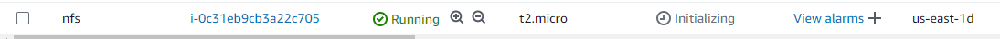
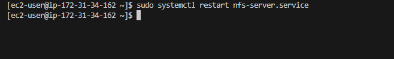
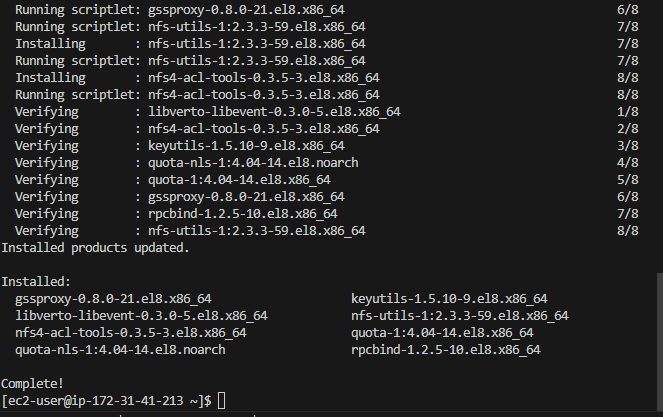
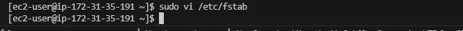
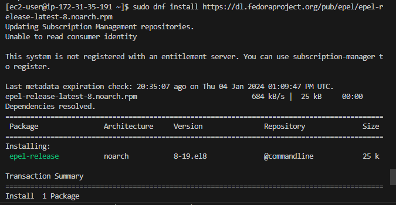
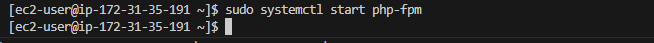

 # Project 7:  Devops Tooling Website Solution

 ### In this project, it consists of following components:

1. Infrastructure: AWS

2. Webserver Linux: Red Hat Enterprise Linux 8. For Rhel 8 server i used this 
ami RHEL-8.6.0_HVM-20220503-x86_64-2-Hourly2-GP2 (ami-035c5dc086849b5de)

3. Database Server: Ubuntu  20.04 + MySQL

4. Storage Server: Red Hat Enterprise Linux 8 + NFS Server

5. Programming Language: PHP

6. Code Repository: GitHub

## Below are the steps I took to complete this project

### Step 1 - Prepare NFS Server

1. Spin up a new EC2 instance with RHEL Linux 8 Operating System.

2. Configure LVM on the Server

a. Created 3 volumes in the same AZ as my Web Server EC2, each of 10 GiB and attached all three volumes one by one to my Web Server EC2 instance

b. Opened up the Linux terminal to begin configuration

c. Used `lsblk` command to inspect what block devices are attached to the server and names of my newly created devices

Note that all devices in Linux reside in /dev/ directory. I inspected it with `ls /dev/` and made sure I see all 3 newly created block devices there - their names are xvdf, xvdh, xvdg.

d. Used `df -h` command to see all mounts and free space on my server

e. Used gdisk utility to create a single partition on each of the 3 disks
`sudo gdisk /dev/xvdf` On the prompts i entered n followed by p and w. I did this step on each of the disks, xvdf,xvdg,xvdh

f. Used `lsblk` utility to view the newly configured partition on each of the 3 disks.

g. I installed lvm2 package using `sudo yum install lvm2`

h. I ran `sudo lvmdiskscan` command to check for available partitions.

i. I used pvcreate utility to mark each of 3 disks as physical volumes (PVs) to be used by LVM
`sudo pvcreate /dev/xvdf1`
`sudo pvcreate /dev/xvdg1`
`sudo pvcreate /dev/xvdh1`

j. I verified that my Physical volume has been created successfully by running `sudo pvs`

k. I used vgcreate utility to add all 3 PVs to a volume group (VG). And named the VG webdata-vg. 
`sudo vgcreate webdata-vg /dev/xvdh1 /dev/xvdg1 /dev/xvdf1`

l. Verified that my VG has been created successfully by running `sudo vgs`

m. Used lvcreate utility to create 3 logical volumes, lv-apps, lv-logs, and lv-opt
`sudo lvcreate -n lv-apps -L 9G webdata-vg`
`sudo lvcreate -n lv-logs -L 9G webdata-vg`
`sudo lvcreate -n lv-opt -L 9G webdata-vg`

n. I verified that my Logical Volume has been created successfully by running `sudo lvs`

o. Verified the entire setup with `sudo vgdisplay -v`

p. Used `sudo lsblk` command to inspect what block devices are attached to the server

q. Use mkfs.xfs to format the logical volumes with xfs filesystem
`sudo mkfs -t xfs /dev/webdata-vg/lv-apps`
`sudo mkfs -t xfs /dev/webdata-vg/lv-logs`
`sudo mkfs -t xfs /dev/webdata-vg/lv-opt`

r. Created /mnt/apps,/mnt/logs, /mnt/opt  directories to store website files, log files etc
`sudo mkdir -p /mnt/apps`
`sudo mkdir -p /mnt/logs`
`sudo mkdir -p /mnt/opt`

s. Created mount points on /mnt directory for the logical volumes as follow:
Mounted lv-apps on /mnt/apps  - To be used by webservers
Mount lv-logs on  /mnt/logs - To be used by webserver logs
Mount lv-opt  on  /mnt/opt  - To be used by Jenkins server in Project 8

`sudo mount /dev/webdata-vg/lv-apps /mnt/apps`
`sudo mount /dev/webdata-vg/lv-opt /mnt/opt/`
`sudo mount /dev/webdata-vg/lv-logs /mntlongs/`

3. Install NFS server, configure it to start on reboot and make sure it is u and running

`sudo yum -y update`

`sudo yum install nfs-utils -y`

`sudo systemctl start nfs-server.service`   `sudo systemctl enable nfs-server.service`   `sudo systemctl status nfs-server.service`

4. Exported the mounts for webservers' subnet cidr to connect as clients. For simplicity, I installed all my three Web Servers inside the same subnet.
And this is how I checked my subnet cidr - I opened my EC2 details in AWS web console and located 'Networking' tab and open a Subnet link.

a. I made sure I set up permission that will allow my Web servers to read, write and execute files on NFS:

`sudo chown -R nobody: /mnt/apps`
`sudo chown -R nobody: /mnt/logs`
`sudo chown -R nobody: /mnt/opt`
`sudo chmod -R 777 /mnt/apps`
`sudo chmod -R 777 /mnt/logs`
`sudo chmod -R 777 /mnt/opt`

`sudo systemctl restart nfs-server.service`

b. Configured access to NFS for clients within the same subnet 

`sudo vi /etc/exports`

`sudo exportfs -arv`

5. Check which port is used by NFS and open it using Security Groups (add new Inbound Rule)

`sudo rpcinfo -p | grep nfs`

### Step 2 — Configure the database server

a. `sudo apt update`

b. Install MySQL server

`sudo apt install mysql-server`

c. Created a database and named it tooling, webaccess as the user, and grant ed permission to webaccess user on tooling database to do anything only from the webservers subnet cidr

`CREATE DATABSE tooling;`
`create user `webaccess`@`172.31.32.0/20` IDENTIFIED BY 'Password';`
`GRANT ALL ON tooling.* TO 'webaccess'@'172.31.32.0/20';`
`FLUSH PRIVILEGES;`
`SHOW DATABASES;`

### Step 3 — Prepare the Web Servers

Durind this step I did the following:

i. Configured NFS client (step must be done on all three servers)
ii. Deployed a Tooling application to our Web Servers into a shared NFS folder
iii. Configured the Web Servers to work with a single MySQL database

1. Launched a new EC2 instance with RHEL 8 Operating System

2. Installed NFS client
`sudo yum install nfs-utils nfs4-acl-tools -y`

3. Mount /var/www/ and target the NFS server's export for apps. 'sudo mount -t nfs -o rw,nosuid <NFS-Server-Private-IP-Address>:/mnt/apps /var/www'

`sudo mkdir /var/www`    `sudo mount -t nfs -o rw,nosuid 172.31.34.162:/mnt/apps /var/www`

4. Verify that NFS was mounted successfully by running `df -h` 

5. To make sure that the changes will persist on Web Server after reboot I ran `sudo vi /etc/fstab` to edit the file and add following line '<NFS-Server-Private-IP-Address>:/mnt/apps /var/www nfs defaults 0 0'
`172.31.34.162:/mnt/apps /var/www nfs defaults 0 0`

6. Install Remi's repository, Apache and PHP

`sudo yum install httpd -y`

`sudo dnf install https://dl.fedoraproject.org/pub/epel/epel-release-latest-8.noarch.rpm`

`sudo dnf install dnf-utils http://rpms.remirepo.net/enterprise/remi-release-8.rpm`

`sudo dnf module reset php`

`sudo dnf module enable php:remi-7.4`

`sudo dnf install php php-opcache php-gd php-curl php-mysqlnd`

`sudo systemctl start php-fpm`

`sudo systemctl enable php-fpm`

`sudo setsebool -P httpd_execmem 1`

7. I verified that Apache files and directories are available on the Web Server in /var/www and also on the NFS server in /mnt/apps. I saw the same files which means NFS was mounted correctly.

On web server, I ran `ls /var/www`

On NFS server, I ran `ls /mnt/apps`

I went ahead to create a new file touch test.txt on the web server and check if the same file is accessible from the NFS Server.

On web server

On NFS server

8. I located the log folder for Apache on the Web Server and mounted it to NFS server's export for logs.

9. I mounted the /mnt/logs to /var/log/httpd.
'sudo mount -t nfs -o rw,nosuid <NFS-Server-Private-IP-Address>:/mnt/logs /var/log/httpd'

`sudo mount -t nfs -o rw,nosuid 172.31.34.162:/mnt/logs /var/log/httpd`

10. To verify the setup
`df -h`

11. To make sure the mount point will persist after reboot, I ran `sudo vi /etc/fstab` to edit the file and add '<NFS-Server-Private-IP-Address>:/mnt/logs /var/log/httpd nfs defaults 0 0'
`172.31.34.162:/mnt/logs /var/log/httpd nfs defaults 0 0`

12. Forked the tooling source code from Darey.io Github Account to my Github account.

I did not have git installed in my system so i took the following step

`sudo yum install git`

Then, cloned the repository into my server

`git clone <the repo link>`

13. Deployed the tooling website's code to the Webserver. Ensured that the html folder from the repository was deployed to /var/www/html

14. To make this change permanent - i opened the following config file `sudo vi /etc/sysconfig/selinux` and set SELINUX=disabled, then restrt httpd.

15. Change the bind address `sudo vi /etc//mysql/mysql.conf.d/mysqld.cnf`

16. Updated the website's configuration to connect to the database in /var/www/html/functions.php file by cd into the location of the tooling folder in my server and applied the tooling-db.sql script to my database 
`sudo vi /var/www/html/functions.php`

17. On the web server install the mysql
`sudo yum install mysql -y`

18. Applied tooling-db.sql script to my database using this command mysql -h <databse-private-ip> -u <db-username> -p <db-pasword> < tooling-db.sql
`sudo mysql -h 172.31.36.84 -u webaccess -p tooling < tooling-db.sql`

19. I logged into the mysql to see the database I created earlier and to see the user and the password

20. I decrypted the password with this site

21. Opened the website in my browser http://<Web-Server-Public-IP-Address-or-Public-DNS-Name>/index.php

